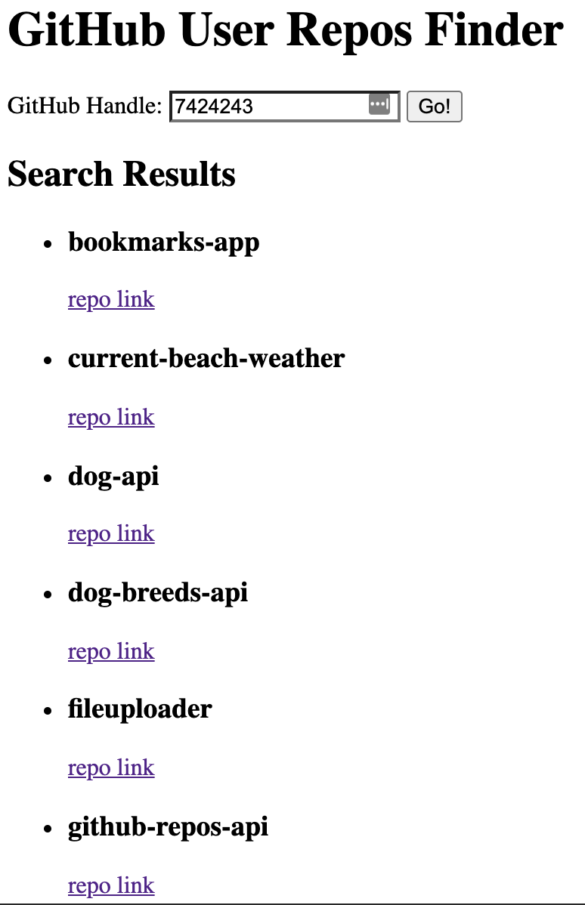

# github-repos-api

Practice assignment using GitHub API

## Live Demo

[Live Demo](https://7424243.github.io/github-repos-api/)

## Screenshots

### Search Section

### Results Section

## Summary

This was a practice assignment for Thinkful. The purpose was to gain more experience working with APIs. This app allows the user to search for a GitHub user's handle and then they are show the repos belonging to the user's handle that was searched.

## Built With

* HTML
* CSS
* JavaScript
* jQuery
